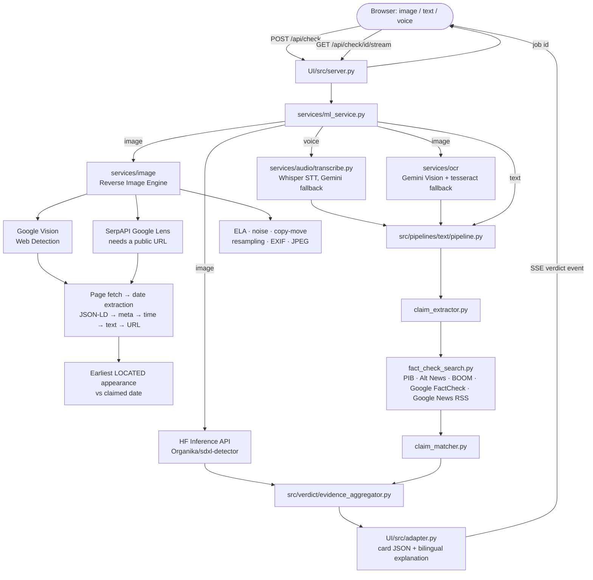

# Satya Web UI — Architecture

The web UI is a **thin front-end over the shared backend**. It does no
fact-checking of its own: it calls the same `services/ml_service.py` functions the
Telegram bot calls, streams progress to the browser, and renders the verdict card.

That is deliberate — the UI used to carry a second copy of the pipelines
(`UI/src/pipelines/`, `UI/src/verdict/`, `UI/src/config.py`). Those copies were
removed: two implementations of the same verdict logic drift apart, and only one of
them was ever maintained.

## How to run

```bash
# from the repo ROOT (the shared backend and .env live there)
python -m UI.run            # → http://localhost:8000
# equivalent: uvicorn UI.src.server:app --port 8000
```

`GET /api/health` shows which API keys are configured. A missing key silently
degrades a pipeline (no `HF_API_KEY` → no AI-image detection; no `GEMINI_API_KEY`
→ no OCR, claim extraction or voice transcription), so check it first when results
look thin.

## Request flow



## SSE protocol

`GET /api/check/{id}/stream` emits, in order:

| Event | Payload | Meaning |
|---|---|---|
| `progress` | `{step, status, message}` | `step` ∈ `analyze` / `search` / `verdict`; `status` ∈ `running` / `completed` / `skipped` / `error`. Steps only ever move forward. |
| `verdict` | the card (see below) | Success — exactly one per check. |
| `failed` | `{error}` | Analysis failed or timed out. Distinct from the transport-level `error` event `EventSource` fires on any disconnect. |
| `done` | `{}` | Stream finished; the client closes the connection. |

## Verdict card

```json
{
  "verdict": "likely_true | likely_false | unverifiable | ai_generated",
  "confidence": 0.0,
  "confidence_level": "HIGH | MODERATE | LOW",
  "explanation_en": "…", "explanation_hi": "…",
  "claim": "what was actually checked", "claim_label": "Claim read from the image",
  "sources": [{ "source_name": "", "source_url": "", "verdict": "", "snippet": "" }],
  "image_flags": ["AI_GENERATED"],
  "disclaimer": "…",
  "meta": { "type": "", "image_ai_score": 0.0, "language": "", "latency_ms": 0 }
}
```

Backend verdicts are `UPPER_SNAKE` (`src/models/schemas.py`); the card uses
lower-case slugs. `UI/src/adapter.py` is the only place that translates between them.

**Verdict rules.** When a claim was checked, the claim's verdict wins — an
AI-generated picture does not make an attached claim false, and a real photo does
not make one true. The AI-image signal always travels separately in `image_flags`.
A bare image with no readable text and no claim is reported as `ai_generated` (when
the detector is ≥ 0.70 confident) or `unverifiable` — never "true", because nothing
was verified.

## Timeouts

| Stage | Budget | Source |
|---|---|---|
| Text pipeline | 45s | `settings.text_pipeline_timeout` |
| Whole check | 58s | `settings.total_timeout` (enforced in `_run_analysis`) |
| Browser socket | 90s | dead-socket guard in `frontend/js/api.js` |

Uploads are written to `UI/uploads/` and deleted in the `finally` of every check —
the footer's "all uploads are deleted after analysis" is enforced in code.
