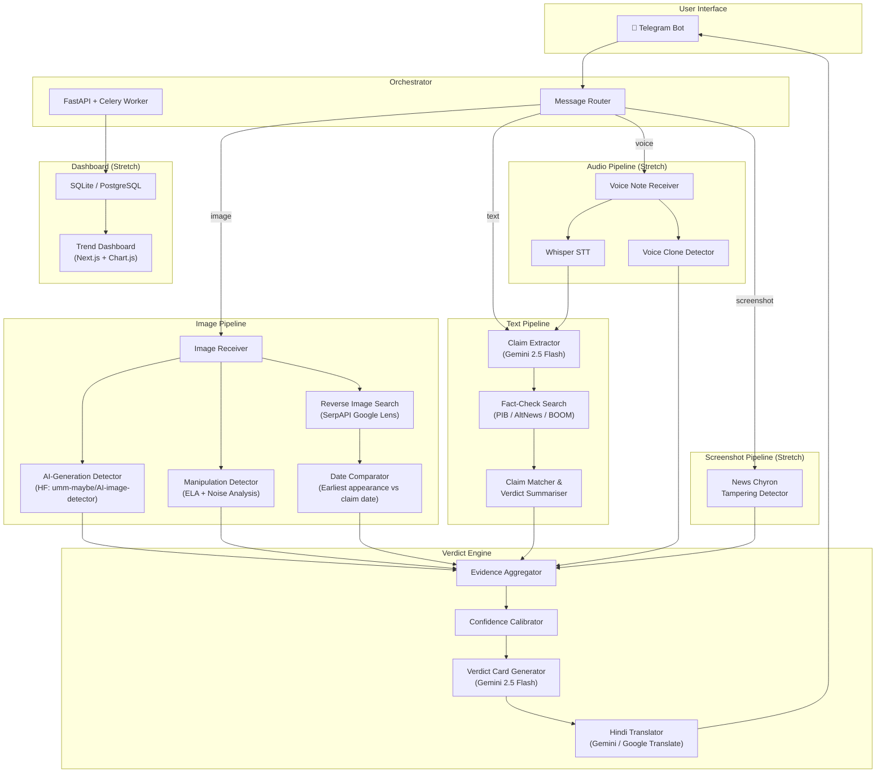

# Satya — AI Forward-Checker for Viral Misinformation

Build a Telegram bot that receives forwarded images, text, or voice notes and returns a plain-language credibility verdict card in **< 60 seconds**, in Hindi + English, with honest confidence levels and source links.

---

## High-Level Architecture



---

## Proposed Changes

### Phase 0 — Project Scaffolding & Configuration

#### [NEW] [pyproject.toml](file:///e:/Desktop/Docs/Projects/parallax/pyproject.toml)
- Python 3.11+ project with dependencies:
  - `python-telegram-bot[ext]` — Telegram integration
  - `fastapi` + `uvicorn` — HTTP server for webhooks & dashboard API
  - `google-generativeai` — Gemini 2.5 Flash for claim extraction, card generation, translation
  - `transformers` + `torch` — HuggingFace deepfake detection models
  - `Pillow` — image manipulation & ELA analysis
  - `serpapi` — reverse image search via Google Lens
  - `openai-whisper` — speech-to-text for voice notes
  - `httpx` — async HTTP client for fact-check scraping
  - `beautifulsoup4` — HTML parsing for fact-check sources
  - `sqlmodel` — lightweight ORM for trend tracking DB
  - `pydantic` — data validation throughout

#### [NEW] [.env.example](file:///e:/Desktop/Docs/Projects/parallax/.env.example)
- Template for all API keys: `TELEGRAM_BOT_TOKEN`, `GEMINI_API_KEY`, `SERPAPI_KEY`

#### [NEW] [config.py](file:///e:/Desktop/Docs/Projects/parallax/src/config.py)
- Centralised settings via Pydantic `BaseSettings`, auto-loading `.env`
- Confidence thresholds, timeout limits (60s budget), model paths

---

### Phase 1 — Telegram Bot & Message Router

#### [NEW] [src/bot/telegram_bot.py](file:///e:/Desktop/Docs/Projects/parallax/src/bot/telegram_bot.py)
- Telegram bot using `python-telegram-bot` (async)
- Handlers for: `/start`, `/help`, forwarded photos, forwarded text, forwarded voice notes
- Shows a "🔍 Checking…" message immediately on receipt with animated typing indicator
- Dispatches to the appropriate pipeline via the router
- Sends back the formatted verdict card as a rich Telegram message (with inline buttons for "View Sources", "Report Error")

#### [NEW] [src/bot/router.py](file:///e:/Desktop/Docs/Projects/parallax/src/bot/router.py)
- Classifies incoming message type: `IMAGE`, `TEXT`, `VOICE`, `SCREENSHOT`, `MIXED`
- For `MIXED` (image + caption): runs both image pipeline and text pipeline in **parallel**
- Returns a `CheckRequest` dataclass with message metadata, content, and detected type

#### [NEW] [src/models/schemas.py](file:///e:/Desktop/Docs/Projects/parallax/src/models/schemas.py)
- Pydantic models for the entire data flow:
  - `CheckRequest` — incoming message metadata
  - `ImageAnalysis` — AI detection score, manipulation score, reverse search results
  - `ClaimAnalysis` — extracted claim, matched fact-checks, verdict
  - `VoiceAnalysis` — transcription, clone detection score
  - `EvidenceBundle` — aggregated evidence from all pipelines
  - `VerdictCard` — final output: verdict, confidence, explanation (EN + HI), sources

---

### Phase 2 — Image Pipeline

This is the core differentiator. Two parallel sub-pipelines: **AI/manipulation detection** and **reverse-context checking**.

#### [NEW] [src/pipelines/image/ai_detector.py](file:///e:/Desktop/Docs/Projects/parallax/src/pipelines/image/ai_detector.py)
- Uses HuggingFace model `umm-maybe/AI-image-detector` (ViT-based, ~95% accuracy on AI-generated images)
- Returns a probability score (0.0–1.0) for "AI-generated"
- Falls back to a secondary model (`Organika/sdxl-detector`) if primary fails
- Adds ELA (Error Level Analysis) as a supplementary signal:
  - Re-save image at known JPEG quality, compute pixel-level difference
  - High variance in ELA → likely manipulated regions
  - Provides a heatmap overlay for the verdict card

#### [NEW] [src/pipelines/image/manipulation_detector.py](file:///e:/Desktop/Docs/Projects/parallax/src/pipelines/image/manipulation_detector.py)
- **Noise analysis**: inconsistent noise patterns across image regions → splicing indicator
- **EXIF metadata check**: strip & analyse metadata for inconsistencies (camera model vs resolution, GPS mismatch, software tags like Photoshop)
- **Copy-move detection**: DCT-based block matching for cloned regions
- Returns a `ManipulationReport` with individual signal scores

#### [NEW] [src/pipelines/image/reverse_search.py](file:///e:/Desktop/Docs/Projects/parallax/src/pipelines/image/reverse_search.py)
- Uses SerpAPI's Google Lens endpoint for reverse image search
- Extracts:
  - Visually similar images with source URLs and dates
  - Page titles and snippets mentioning the image
  - "Exact match" vs "similar" classification
- **Date comparison logic**: 
  - Parse dates from matched pages (publication date from meta tags, URL patterns, snippet text)
  - If the earliest appearance is significantly older than the claim date → **recycled image** flag
  - Compute a "recency score" — how old is the original vs the forward

#### [NEW] [src/pipelines/image/pipeline.py](file:///e:/Desktop/Docs/Projects/parallax/src/pipelines/image/pipeline.py)
- Orchestrator that runs AI detection, manipulation detection, and reverse search **in parallel** using `asyncio.gather`
- Merges results into a single `ImageAnalysis` object
- Timeout: 30 seconds max for entire image pipeline (leaves 30s budget for verdict generation)

---

### Phase 3 — Text-Claim Pipeline

#### [NEW] [src/pipelines/text/claim_extractor.py](file:///e:/Desktop/Docs/Projects/parallax/src/pipelines/text/claim_extractor.py)
- Uses Gemini 2.5 Flash with a carefully crafted prompt to:
  - Extract the **core factual claim** from a rambling WhatsApp forward
  - Identify named entities (people, places, events, dates)
  - Classify claim type: `POLITICAL`, `HEALTH`, `DISASTER`, `RELIGIOUS`, `FINANCIAL`, `OTHER`
  - Rate claim's "checkability" — is this an opinion or a verifiable fact?
- Example: "Modi ji ne kaha ki sab logo ko 15 lakh milenge, ye dekho video..." → **Claim: "PM Modi promised ₹15 lakh to every citizen"**

#### [NEW] [src/pipelines/text/fact_check_search.py](file:///e:/Desktop/Docs/Projects/parallax/src/pipelines/text/fact_check_search.py)
- Searches three fact-check sources **in parallel**:
  1. **PIB Fact Check** (`factcheck.pib.gov.in`) — scrape + search their database
  2. **AltNews** (`altnews.in`) — site search via Google (site:altnews.in + claim keywords)
  3. **BOOM** (`boomlive.in`) — same approach
- Also queries **Google Fact Check Tools API** (free, covers ClaimReview schema from multiple publishers)
- For each match, extracts:
  - Original claim text
  - Verdict (true/false/misleading/out of context)
  - Date of fact-check
  - Source URL
  - Summary snippet

#### [NEW] [src/pipelines/text/claim_matcher.py](file:///e:/Desktop/Docs/Projects/parallax/src/pipelines/text/claim_matcher.py)
- Uses Gemini to semantically match the user's claim against retrieved fact-checks
- Handles paraphrasing, language differences (Hindi claim → English fact-check)
- Produces a match confidence score (0.0–1.0)
- If no match found: sets verdict to `UNVERIFIABLE` with honest explanation
- If multiple conflicting fact-checks: reports the disagreement transparently

#### [NEW] [src/pipelines/text/pipeline.py](file:///e:/Desktop/Docs/Projects/parallax/src/pipelines/text/pipeline.py)
- Sequential: extract claim → search fact-checks → match & summarise
- Timeout: 25 seconds max
- Returns `ClaimAnalysis` with verdict, matched sources, and confidence

---

### Phase 4 — Verdict Engine (The Brain)

This is where hackathon-winning calibration happens.

#### [NEW] [src/verdict/aggregator.py](file:///e:/Desktop/Docs/Projects/parallax/src/verdict/aggregator.py)
- Combines evidence from all pipelines into an `EvidenceBundle`
- Handles mixed-content messages (image + text caption): cross-references image findings with text claim
- Weighs evidence based on source reliability and signal strength

#### [NEW] [src/verdict/confidence.py](file:///e:/Desktop/Docs/Projects/parallax/src/verdict/confidence.py)
- **Calibrated confidence scoring** — the 30% judging weight item:
  - Maps raw scores to calibrated probabilities using a decision matrix
  - Rules:
    - Single weak signal → `UNVERIFIABLE` (never jump to `FALSE` on thin evidence)
    - Multiple corroborating signals → higher confidence
    - Conflicting signals → lower confidence, flag uncertainty
    - AI-generated + no fact-check match → "Likely AI-generated, claim unverifiable"
    - Recycled image + matching fact-check → "Previously debunked recycled image"
  - Confidence levels: `HIGH` (>0.85), `MODERATE` (0.6–0.85), `LOW` (<0.6)
  - **Key design choice**: `UNVERIFIABLE` is always available and preferred over a low-confidence `FALSE`

#### [NEW] [src/verdict/card_generator.py](file:///e:/Desktop/Docs/Projects/parallax/src/verdict/card_generator.py)
- Uses Gemini 2.5 Flash to generate a **grandparent-readable** verdict card
- Card structure:
  ```
  ━━━━━━━━━━━━━━━━━━━━━━━━
  🟢 LIKELY TRUE / 🟡 UNVERIFIABLE / 🔴 LIKELY FALSE
  Confidence: ██████░░░░ 65%
  
  🔍 What we found (English):
  This photo is from the 2018 Kerala floods, not from
  yesterday's cyclone in Odisha. We found the original
  on NDTV dated Aug 2018.
  
  🔍 हमने क्या पाया (हिंदी):
  यह फोटो 2018 की केरल बाढ़ की है, कल ओडिशा में आए
  तूफान की नहीं। मूल फोटो NDTV पर अगस्त 2018 की मिली।
  
  📎 Sources: [1] NDTV · [2] PIB Fact Check
  
  ⚠️ Note: Our AI check is not 100% accurate.
  Always verify with official sources.
  ━━━━━━━━━━━━━━━━━━━━━━━━
  ```
- Prompt engineering for:
  - Simple language (8th grade reading level)
  - No jargon ("ELA analysis" → "image editing traces")
  - Honest hedging ("we found signs that..." not "this IS fake")

#### [NEW] [src/verdict/translator.py](file:///e:/Desktop/Docs/Projects/parallax/src/verdict/translator.py)
- Uses Gemini for culturally-appropriate Hindi translation (not literal)
- Handles code-switching (Hinglish) naturally
- Regional language support extensible to Tamil, Bengali, Telugu via config

---

### Phase 5 — Stretch Goals

#### [NEW] [src/pipelines/audio/voice_analyzer.py](file:///e:/Desktop/Docs/Projects/parallax/src/pipelines/audio/voice_analyzer.py)
- **Whisper STT**: transcribe voice note → feed into text pipeline
- **Voice clone detection**: spectral analysis for synthetic voice markers
  - Check for unnaturally smooth pitch contours
  - Analyse formant transitions for AI-generated speech artifacts
- Returns transcription + clone detection confidence

#### [NEW] [src/pipelines/screenshot/chyron_detector.py](file:///e:/Desktop/Docs/Projects/parallax/src/pipelines/screenshot/chyron_detector.py)
- Detects news channel screenshots (template matching for known channel logos: NDTV, Aaj Tak, Republic, etc.)
- OCR on the chyron/ticker text using Gemini Vision
- Cross-references extracted text with actual news from that channel
- Flags if the chyron text doesn't match any real broadcast

#### [NEW] [src/dashboard/](file:///e:/Desktop/Docs/Projects/parallax/src/dashboard/)
- **FastAPI endpoints** serving trend data
- **Simple Next.js frontend** with:
  - Real-time feed of recent checks
  - Cluster view: groups similar forwards being checked simultaneously
  - Heat map of claim categories
  - Latency metrics per forward type

---

### Phase 6 — Database & Logging

#### [NEW] [src/db/models.py](file:///e:/Desktop/Docs/Projects/parallax/src/db/models.py)
- SQLModel tables:
  - `ForwardCheck` — every check request with timestamps, latency, verdict
  - `FactCheckSource` — cached fact-check results to avoid re-scraping
  - `TrendCluster` — groups of similar claims for dashboard

#### [NEW] [src/db/database.py](file:///e:/Desktop/Docs/Projects/parallax/src/db/database.py)
- SQLite for hackathon (PostgreSQL-ready via connection string swap)
- Async session management

---

### Phase 7 — Deliverables & Documentation

#### [NEW] [docs/architecture.md](file:///e:/Desktop/Docs/Projects/parallax/docs/architecture.md)
- Pipeline architecture diagram (Mermaid) — what checks what, in what order
- Data flow for each forward type (image, text, voice, mixed)

#### [NEW] [docs/blind_spots.md](file:///e:/Desktop/Docs/Projects/parallax/docs/blind_spots.md)
- Documented blind spots:
  - **Memes with text overlay**: OCR + fact-check, but satire detection is weak
  - **Highly localised claims**: regional events not covered by PIB/AltNews/BOOM
  - **Video deepfakes**: out of scope (image-only pipeline)
  - **Encrypted/DM-only context**: no access to original forward chain
  - **Novel AI models**: detection models may not catch bleeding-edge generators
  - **Audio in non-Hindi/English languages**: Whisper accuracy drops
  - **First-time misinformation**: if no fact-check exists yet, verdict is UNVERIFIABLE (by design)

#### [NEW] [docs/latency.md](file:///e:/Desktop/Docs/Projects/parallax/docs/latency.md)
- Latency budget per forward type:
  | Forward Type | Target (GPU) | Breakdown |
  |---|---|---|
  | Text only | 5–10s | Claim extraction (2s) + Fact-check search (4s) + Card gen (2s) |
  | Image only | 8–20s | AI detection (1s GPU) ∥ Reverse search (8s) + Card gen (2s) |
  | Image + caption | 10–25s | Image pipeline ∥ Text pipeline (parallel) + Merge + Card gen |
  | Voice note | 12–25s | Whisper STT (5s GPU) + Text pipeline (10s) + Card gen (2s) |
  | Screenshot | 8–18s | Channel detection (2s) + OCR (2s) + Cross-ref (8s) + Card gen |

#### [NEW] [tests/judging_set.py](file:///e:/Desktop/Docs/Projects/parallax/tests/judging_set.py)
- The 8-item live judging set runner:
  - 2 true claims, 2 false claims, 2 unverifiable claims, 2 adversarial trick forwards
  - Automated scoring script that measures accuracy, latency, and card quality

---

## Execution Timeline (24-Hour Hackathon)

| Time Block | Hours | What Gets Built | Milestone |
|---|---|---|---|
| **Block 1** | 2 hrs | Phase 0 + Phase 1: Scaffolding, Telegram bot, router, schemas, `.env` setup | Bot receives & echoes messages |
| **Block 2** | 4 hrs | Phase 2: Full image pipeline — AI detector (GPU-accelerated), ELA manipulation detector, reverse image search + date comparison | Image verdict working end-to-end |
| **Block 3** | 3 hrs | Phase 3: Text-claim pipeline — Gemini claim extraction, parallel fact-check scraping (PIB/AltNews/BOOM + Google Fact Check API), semantic matching | Text verdict working end-to-end |
| **Block 4** | 3 hrs | Phase 4: Verdict engine — evidence aggregator, calibrated confidence scoring, card generator, Hindi translation. Full pipeline integrated | Send any forward → get verdict card |
| **Block 5** | 4 hrs | Phase 5: All stretch goals — Whisper voice-note analysis + clone detection, news chyron tampering detector, trend dashboard (FastAPI + frontend) | All input types handled |
| **Block 6** | 2 hrs | Phase 6: Database logging, trend clustering, caching for repeated claims | Dashboard populated with real data |
| **Block 7** | 2 hrs | Phase 7: Documentation — architecture diagram, blind spots doc, latency benchmarks, pipeline flowcharts | All deliverables complete |
| **Block 8** | 2 hrs | Demo polish — judging set dry-run (all 8 items), edge case fixes, Telegram UX refinements (inline buttons, typing indicators, error handling), demo script | Ready for live judging |
| **Buffer** | 2 hrs | Sleep / unexpected issues / last-minute improvements | Confidence buffer |

---

## Tech Stack Summary

| Component | Technology | Why |
|---|---|---|
| Bot Platform | Telegram Bot API | Fastest to demo, rich message formatting, free |
| Language/Runtime | Python 3.11+ / asyncio | ML ecosystem, async for parallelism |
| LLM | Gemini 2.5 Flash | Fast, cheap, multilingual, good at structured output |
| AI Image Detection | `umm-maybe/AI-image-detector` (HuggingFace) | Open, ViT-based, ~95% accuracy |
| Manipulation Detection | Custom (Pillow + NumPy) | ELA, noise analysis, EXIF checks |
| Reverse Image Search | SerpAPI (Google Lens) | Reliable, structured JSON response |
| Fact-Check Search | Google Fact Check Tools API + site scraping | Free API + comprehensive coverage |
| Voice STT | OpenAI Whisper (small/medium) | Best open-source STT, Hindi support |
| Database | SQLite (SQLModel ORM) | Zero config, hackathon-appropriate |
| Dashboard | FastAPI + simple HTML/JS | Minimal overhead |

---

## User Review Required

> [!IMPORTANT]
> **API Keys Needed Before We Start:**
> 1. **Telegram Bot Token** — create via [@BotFather](https://t.me/BotFather) on Telegram
> 2. **Gemini API Key** — from [Google AI Studio](https://aistudio.google.com/apikey)
> 3. **SerpAPI Key** — from [serpapi.com](https://serpapi.com) (free tier: 100 searches/month)
>
> Do you have these, or should I plan for mock/fallback implementations?

> [!IMPORTANT]
> **Regional Language Choice:**
> The plan defaults to **Hindi** as the regional language. Should I target a different language (Tamil, Bengali, Telugu, Marathi) or support multiple?

> [!WARNING]
> **Model Download Size:**
> The HuggingFace AI-image-detector model is ~350MB. Whisper medium is ~1.5GB. If bandwidth is limited during the hackathon, I can use smaller models with a slight accuracy trade-off.

## Open Questions

1. ~~**Hackathon duration?**~~ → **24 hours** ✅ All stretch goals are in scope.
2. ~~**GPU availability?**~~ → **Yes** ✅ GPU-optimized latency targets applied.
3. ~~**Demo format?**~~ → **Live demo** ✅ Extra polish on Telegram UX, error handling, and typing indicators.
4. **Do you want a presentation deck?** I can generate slides alongside the code if needed.
5. **API keys ready?** Telegram Bot Token, Gemini API Key, SerpAPI Key — do you have these, or should I set up mocks first?

## Verification Plan

### Automated Tests
- `python tests/judging_set.py` — runs all 8 judging items through the bot and reports:
  - Verdict accuracy (expected vs actual)
  - Latency per item
  - Card readability check (length, language detection)
- `pytest tests/` — unit tests for each pipeline component

### Manual Verification
- Send 5+ real WhatsApp forwards to the Telegram bot and verify:
  - Response arrives in < 60 seconds
  - Hindi translation is natural and accurate
  - Sources are clickable and valid
  - "Unverifiable" is returned when appropriate (not a lazy "false")
- Adversarial test: send a true claim with a misleading image, verify the system catches the mismatch
